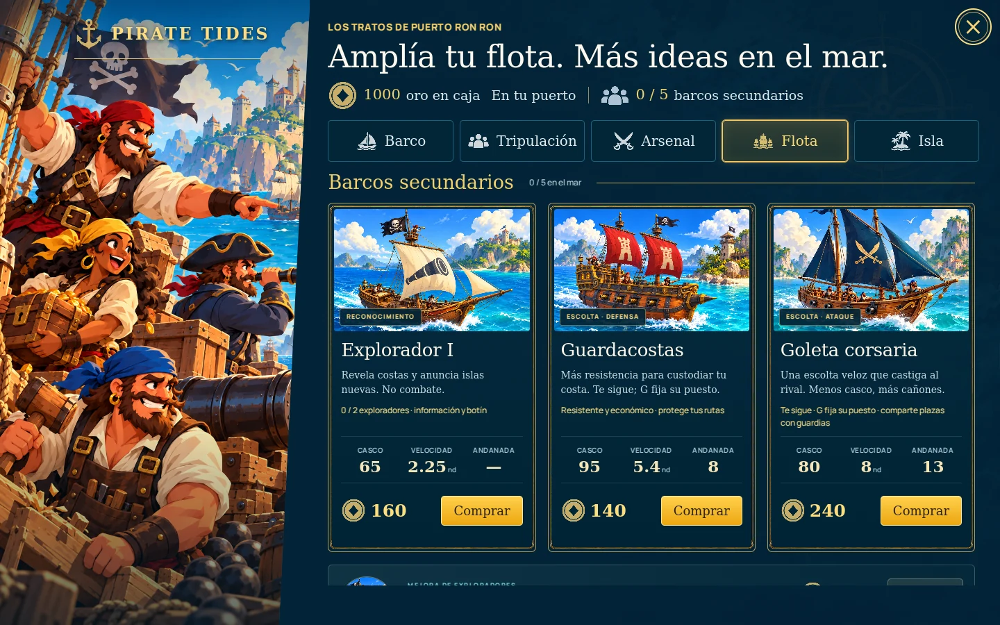
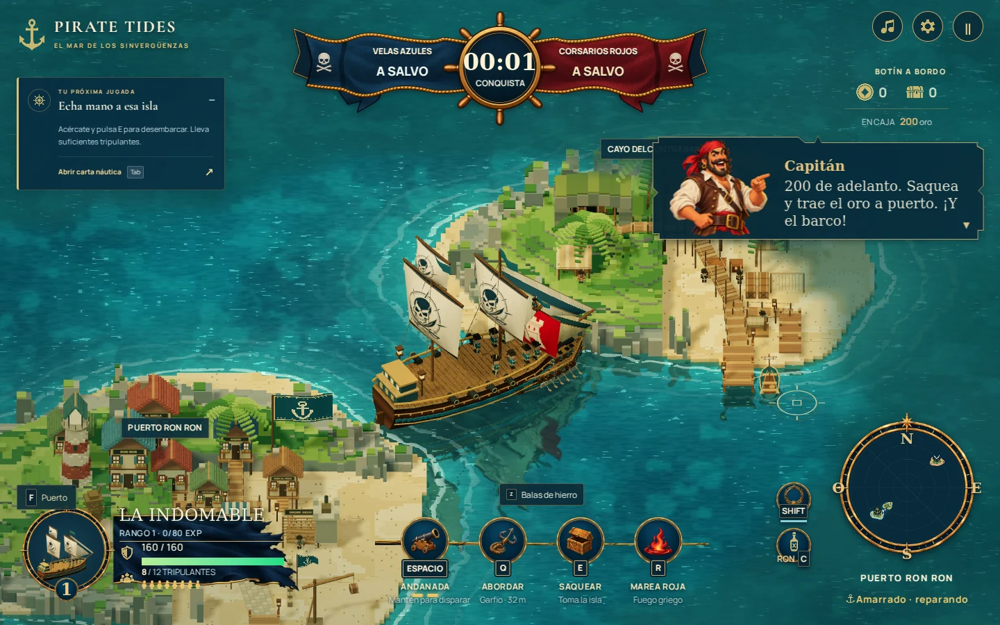
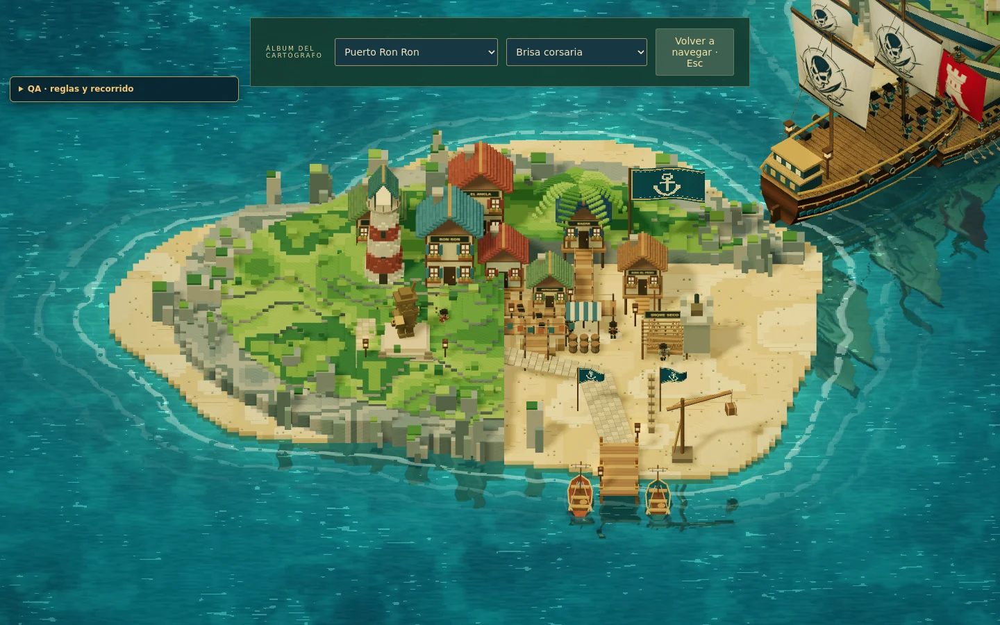
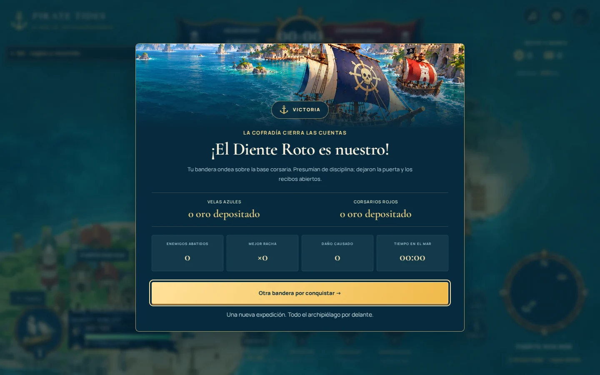

# Revisión visual · Pirate Tides

Capturas reales del juego en navegador, a 1440 × 900. El puerto del álbum, las compras de flota y el resultado usan las escenas de revisión `?qa=1`; las cifras del resultado son cero porque es una prueba visual, no una partida ganada. La bienvenida y la navegación se capturaron en el flujo normal.

## Bienvenida ilustrada

## Puerto y flota

## Navegación

## Costas con vida

## Cierre de expedición

Se verificaron compras y límites de flota, pausa del reloj, reanudación con P/Escape, carta náutica, marcador de destino, control manual y distribución vertical a 390 × 844. No se detectaron excepciones JavaScript, errores de shaders ni recursos fallidos en esos recorridos. El rendimiento del navegador de revisión usa renderizado por software; estas capturas no certifican una tasa de FPS en hardware real.
