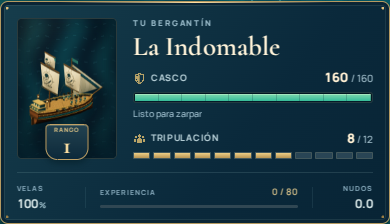
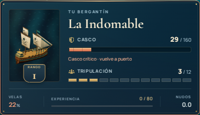
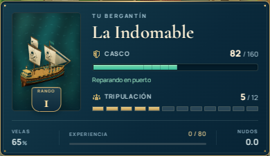
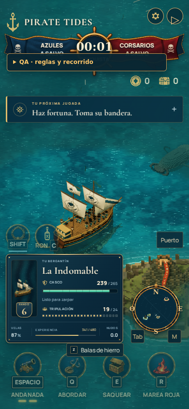

# Revisión visual · Pirate Tides

Capturas reales del juego en navegador. Las escenas generales son de 1440 × 900; el HUD también incluye pantallas móviles y recortes a tamaño nativo. El puerto del álbum, las compras de flota, el resultado y los estados del HUD usan las escenas de revisión `?qa=1`; las cifras del resultado son cero porque es una prueba visual, no una partida ganada. La bienvenida y la navegación se capturaron en el flujo normal.

## HUD inferior izquierdo

El panel reemplaza el marco recortado y las filas posicionadas por porcentajes. Casco y tripulación tienen prioridad; velas, experiencia y velocidad permanecen en una franja secundaria. Los lugares vacantes de la tripulación quedan visibles, también con capacidad ampliada. El barco usa el retrato de su modelo real sobre agua animada por shader.

El daño muestra la cantidad perdida, una breve iluminación del borde y una estela ámbar en la barra. Casco crítico, incendio, reparación y naufragio tienen mensajes propios. La reparación añade un reflejo que recorre la barra; el rango recibe un destello y un pequeño movimiento de su insignia. El movimiento reducido desactiva el balanceo, los destellos y los recorridos decorativos.

La versión vertical de 390 × 844 conserva el retrato y las 24 plazas de una mejora. A 320 px el rango pasa al encabezado para mantener la lectura de las cifras. Las pantallas verticales bajas priorizan el estado del barco y los controles sobre la guía de objetivos.

### Comprobaciones de esta pasada

- Compilación de producción y 29 archivos de pruebas Node correctos.
- Diez tamaños de ventana: 320 × 568, 360 × 640, 390 × 844, 667 × 375, 768 × 1024, 844 × 390, 1024 × 768, 1280 × 720, 1440 × 900 y 1920 × 1080.
- Sin desbordes del panel ni cruces con puerto, habilidades, minimapa o controles de navegación en las medidas probadas. Revisión adicional del espacio de la guía a 320 × 568.
- Casco crítico, incendio, reparación real al reanudar la simulación, rango 6 con 24 plazas y naufragio comprobados en navegador. Sin excepciones JavaScript ni errores de shader durante el recorrido.
- La estela de daño se comprobó con actualizaciones repetidas del mismo estado: después de perder el 50% del casco, la barra principal ya estaba en 50% a los 230 ms mientras la estela permanecía en 100%; luego alcanzó el valor real. La animación de reparación se desactiva con movimiento reducido.

Para repetir la revisión, ejecutar `npm run dev -- --port 5174`, abrir `http://127.0.0.1:5174/?qa=1` y elegir los casos **HUD** del panel de revisión. **HUD · impacto** resta 46 de casco al estado actual. Pulsar **P** en el caso de reparación permite observar la recuperación real del barco.

## Bienvenida ilustrada

## Puerto y flota

## Navegación

## Costas con vida

## Cierre de expedición

Se verificaron compras y límites de flota, pausa del reloj, reanudación con P/Escape, carta náutica, marcador de destino, control manual y distribución vertical a 390 × 844. No se detectaron excepciones JavaScript, errores de shaders ni recursos fallidos en esos recorridos. El rendimiento del navegador de revisión usa renderizado por software; estas capturas no certifican una tasa de FPS en hardware real.
